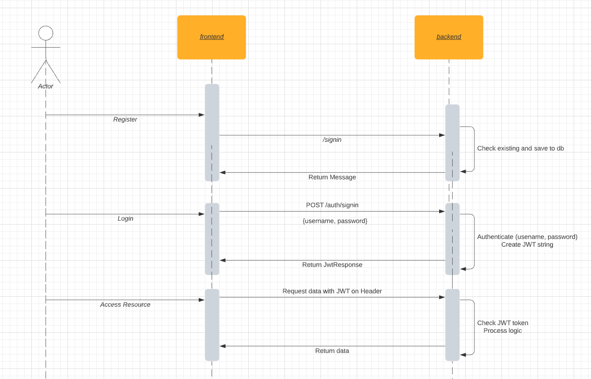

## Stack

- [Ruby](https://www.ruby-lang.org/en/) 2.7.2
- [Rails](https://rubyonrails.org/) 6.1.4
- [React.js](https://reactjs.org/) 17.0.2
- [Docker](https://docs.docker.com/)
- [PostgreSQL](https://www.postgresql.org/)

## Usage

```shell
$ git clone git@github.com:blueman-vu/user-manager.git && cd user-manager

# Setup
$ docker-compose run api bin/rails db:create db:migrate db:seed
$ docker-compose run web npm install

Admin: admin@test.com/password

# Start
$ docker-compose up -d

# Open web
$ open http://localhost:80 # You'll see yaichi page, then click any app
```
## Document

### API Diagram


### API Design

`API Design.xlsx`